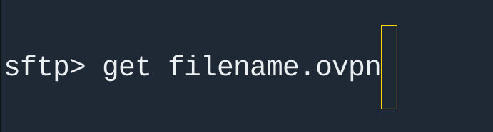

# آموزش راه اندازی OpenVPN روی سرور لینوکسی

## هدف آموزش
با توجه به قطعی گسترده اینترنت، بسیاری از مردم به سمت وی‌پی‌ان‌های   رایگان هجوم آوردن. این وی‌پی‌ان‌ها معمولا سریع از طرف دولت بلاک میشن.

برای راه‌اندازی vpn نیاز دارید تا قبل اون یه vps (سرور مجازی) تهیه کنید.

اگر اینترنت شما ملی شده، بهتره که vps داخل ایران تهیه کنید، در غیر این صورت برای دسترسی به اینترنت بدون فیلتر بهتره که vps خارج از ایران تهیه کنید.

بعد از کانفیگ vps میتونید خودتون و دوستان و خانواده‌تون به صورت همزمان و امن و با بهترین کیفیت و سرعت از vpn شخصی خودتون استفاده کنید.

اگر خارج ایران هستید، میتونید با تهیه vps ارزان قیمت و کانفیگ vpn روی سرور و ارسال فایل ovpn برای دیگران، به راحتی به عزیزانتون در ایران، اینترنت برسونید.

<br>

## متصل شدن به سرور


اولین چیزی که از سرور مقصد نیاز داریم IP اون سرور هستش. توی این سناریو IP ما 69.162.81.155 هستش.

دومین موردی که بهش نیاز داریم، یوزری هستش که میخوایید به سرور لینوکسی دستور بدید. ما اینجا از یوزر root استفاده میکنیم.

سومین مورد، پسورد هستش. پسورد فرضی ما 12345 هستش.


فرض رو بر این میگیریم که سیستم‌عاملی که میخوایید از طریقش به سرور لینوکسی وصل بشید هم لینوکسه. پس ترمینال لینوکس رو باز می‌کنیم و دستور زیر رو وارد می‌کنیم.

```bash
ssh root@69.162.81.155
```


اگه آدرس سرور و یوزر رو درست زده باشید، با همچین چیزی مواجه میشید که باید پسورد رو وارد کنید:

*قاعدتا لینوکس من کرونا نگرفته، قصدم مخفی کردن IP بود!


بعد از وارد کردن پسورد، اگه پسورد درست باشه، باید در جواب سوال، "yes" رو تایپ کنید و enter کنید.


اگه با همچین چیزی مواجه شدید، یعنی اینکه شما تونستید به سرور لینوکسی متصل بشید. پس تبریک می‌گم :)


## نصب OpenVPN روی سرور

وقتی وارد سرور شدید، میتونید توی همون دایرکتوری که هستید یا هر دایرکتوری این دستور رو بزنید.

```bash
wget https://git.io/vpn -O openvpn-install.sh && bash openvpn-install.sh
```

حالا شما فایل ستاپ openvpn رو دانلود کردید همزمان اجرا کردید. 
بعد از دستور بالا، این صفحه برای شما باز میشه که باید کانفیگ مد نظرتون رو فقط برای یکبار بهش بدید:


پیشنهاد من اینه که سوالات رو اینجوری جواب بدید.
### Which protocol should OpenVPN user? 
- UDP
### What port should OpenVPN listen to?
- 443
### Select DNS server for the clients?
- 1.1.1.1
### Enter a name for the first client:
- هر اسمی که دوست دارید


# دانلود فایل OpenVPN از سرور
حالا وی‌پی‌ان شما کانفیگ شده و یه پروفایل OpenVPN روی سرور شما ایجاد شده که باید دانلودش کنید

راحت‌ترین راه برای دانلود فایل OpenVPN با پسود ovpn استفاده از sftp هستش
برای اینکار، یک ترمینال دیگه باز کنید و مثل ssh زدن باید از یوزرنیم و IP و پسورد استفاده کنید

```bash
sftp root@69.162.81.155
```

خب حالا از طریق sftp وارد ترمینال شدیم.

با دستور ls میتونیم لیست فایل‌ها رو ببینیم

بعد از اینکه فایل رو پیدا کردیم با دستور زیر میتونیم فایل رو دانلود کنیم

```bash
get filename.ovpn
```



حالا فایل توی سیستم شما دانلود شده. 


## استفاده از VPN
کار ما سمت سرور تمام شده.

حالا باید از طریق این فایل به vpn وصل بشم.

برای اینکار می‌تونید از اپلیکیشن‌های اندرویدی ios لینوکس یا ویندوز استفاده کنید


فقط فایل رو توی نرم‌افزار اوپن‌وی‌پی‌ان import کنید و بدون نیاز به وارد کردن یوزر و پسورد دکمه connect رو بزنید.

<br>

نکته: اگر پورت ۴۴۳ از سمت ISP شما بسته باشه می‌تونید پورت‌های دیگه رو امتحان کنید.

با هرفایل فقط یک نفر میتونه به vpn وصل بشه. اما نگران نباشید.

اگر به تعداد بیشتری فایل نیاز دارید کافه که دوباره به سرور ssh بزنید و با دستور زیر دوباره فایل bash رو اجرا کنید.


```bash
sudo bash openvpn-install.sh
```

بعد از اینکه این دستور رو زدید، با صفحه زیر مواجه میشید.


روی گزینه add new client بزنید و به راحتی یه فایل دیگه تولید کنید و با دستور sftp دانلودش کنید.

محدودیتی توی تولید و دانلود فایل نیست، اما استفاده همزمان از vpn بستگی به منابع سرورتون رداره.

<br>

## حمایت
### مالی
برای حمایت مالی این آموزش و آموزش‌های آینده می‌تونید از طریق کریپتو اقدام کنید.

Bitcoin:

```bash
bc1qrfzym2mzu82hhwap7kzpm30u3c2u2zptr8edn7
```

USDT (ERC20 & BEP20):


```bash
0xE365E73a7aa3250E82Ef8a4f0AA2d0c0332505e7
```

### غیر مالی
برای کمک به این آموزش می‌تونید اشکالات اون رو رفع کنید یا جزئیات بیشتری اضافه کنید. برای اینکار از پروژه fork بگیرید و تغییراتتون رو به صورت Pull Request بفرستید.

<br>

# سوال دارید؟
اگر توی آموزش ابهامی براتون وجود داره یا سوالی دارید، میتوید از طریق Issue اون رو مطرح کنید.